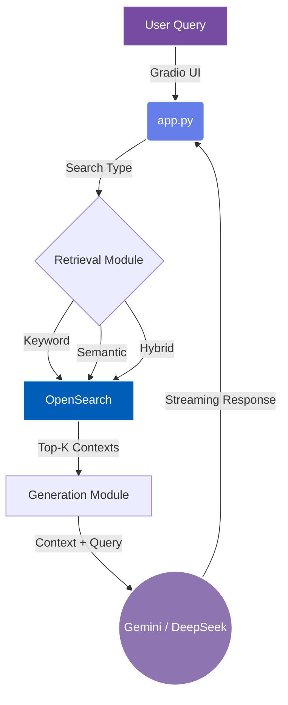

<div align="center">

# 🚀 Multimodal Local RAG
**A powerful, fully-local, multimodal Retrieval-Augmented Generation application.**

[](https://www.python.org/)
[](https://gradio.app/)
[](https://ollama.ai/)
[](https://opensearch.org/)
[](https://deepmind.google/technologies/gemini/)

*Seamlessly search and chat with your local documents and images.*

</div>

---

## 🌟 Overview

Welcome to **LocalRAG Q&A System**, a robust, end-to-end fullstack application that brings the power of **Retrieval-Augmented Generation (RAG)** entirely to your local machine! 

Designed for **multimodal data** (text and images), this system intelligently parses PDFs, generates semantic embeddings, and stores them in a lightning-fast vector database. You can query your data via an elegant **Gradio UI**, retrieving precise answers augmented by advanced LLMs like DeepSeek and Gemini.

---

## ✨ Key Features

- **🧠 Multimodal RAG**: Seamlessly handles text and images for rich, context-aware retrieval.
- **🏠 Local Architecture Focus**: Keep your core infrastructure independent. Runs major components locally using Docker and Ollama.
- **⚡ Advanced Search Modes**: Supports **Keyword**, **Semantic**, and **Hybrid Search** algorithms.
- **📦 Seamless Integrations**: Power-packed with **Ollama** (DeepSeek-R1 / Nomic Embeddings), **Gemini API** for cloud inference, and **OpenSearch**.
- **📄 Smart Document Processing**: Utilizes advanced PDF parsing and semantic chunking for high-accuracy context matching.
- **🎨 Stunning UI**: Interactive, streaming Gradio interface built with gradient visuals and smooth user experience.

---

## 🏗️ Architecture Workflow



---

## 🚀 Quick Start Guide

### 1. 🛠️ Prerequisites
Ensure you have the following installed:
- [Python 3.13+](https://www.python.org/downloads/)
- [Docker](https://www.docker.com/products/docker-desktop) & [Docker Compose](https://docs.docker.com/compose/)
- [Git](https://git-scm.com/)

### 2. 📥 Installation

**Clone the repository:**
```bash
git clone https://github.com/Tanveer457/Multi_Rag_System.git
cd Multi_Rag_System
```

**Set up your virtual environment:**
```bash
# Using standard venv
python -m venv .venv

# Activate it (Windows)
.venv\Scripts\activate
# Activate it (Mac/Linux)
source .venv/bin/activate
```

**Install dependencies:**
```bash
# Using uv (recommended)
uv sync

# Alternatively, using standard pip
pip install -e .
```

### 3. 🐳 Running Services

**Start OpenSearch & Dashboards:**
```bash
docker compose -f docker-compose.yml up -d
```
> **Note:** OpenSearch runs on `localhost:9200`, and Dashboards on `localhost:5601`.

**Install and Start Ollama:**
```bash
docker run -d -v ollama:/root/.ollama -p 11434:11434 --name ollama ollama/ollama
```

**Pull Required Models into Ollama:**
```bash
docker exec -it ollama ollama run deepseek-r1:1.5b          
docker exec -it ollama ollama run nomic-embed-text # Used for generating local embeddings
```

### 4. 🔑 Configuration
Create a `.env` file in the project root and add your API keys. *We use Gemini for high-performance generative inference.*
```env
GEMINI_API_KEY=your_gemini_api_key_here
```

### 5. 📚 Data Ingestion
Before querying, you need to parse, chunk, and index your PDF documents into the OpenSearch database:
```bash
python ingestion.py
```

### 6. 🔥 Launch the App!
Start the beautiful local RAG interface:
```bash
python app.py
```
Open your browser and navigate to `http://0.0.0.0:7860` to start asking questions!

---

## 📂 Project Structure

```text
📁 localrag/
├── 📄 app.py               # Main Gradio UI and application entry point
├── 📄 chunking.py          # Advanced PDF parsing and data chunking logic
├── 📄 generation.py        # LLM streaming and RAG context generation
├── 📄 retrieval.py         # OpenSearch hybrid/semantic retrieval utilities
├── 📄 ingestion.py         # Document ingestion pipeline into VectorDB
├── 📄 helper.py            # Utility and supporting modules
├── 🐳 docker-compose.yml   # Docker configurations for OpenSearch
└── 📄 pyproject.toml       # Python dependencies and metadata config
```

---

## 🔗 Resources & Acknowledgements

- **Research Inspiration**: [Multimodal RAG Paper (arxiv.org/pdf/2312.10997)](https://arxiv.org/pdf/2312.10997)
- **Local Models (Ollama)**:
  - [Nomic Embed Text Model](https://www.ollama.com/library/nomic-embed-text)
  - [DeepSeek-R1 Language Model](https://www.ollama.com/library/deepseek-r1)
- **Containerization**: [Run Ollama via Docker (Official Guide)](https://ollama.com/blog/ollama-is-now-available-as-an-official-docker-image)

<br/>
<div align="center">
  <i>Built with ❤️ using cutting-edge Open Source Tools</i>
</div>